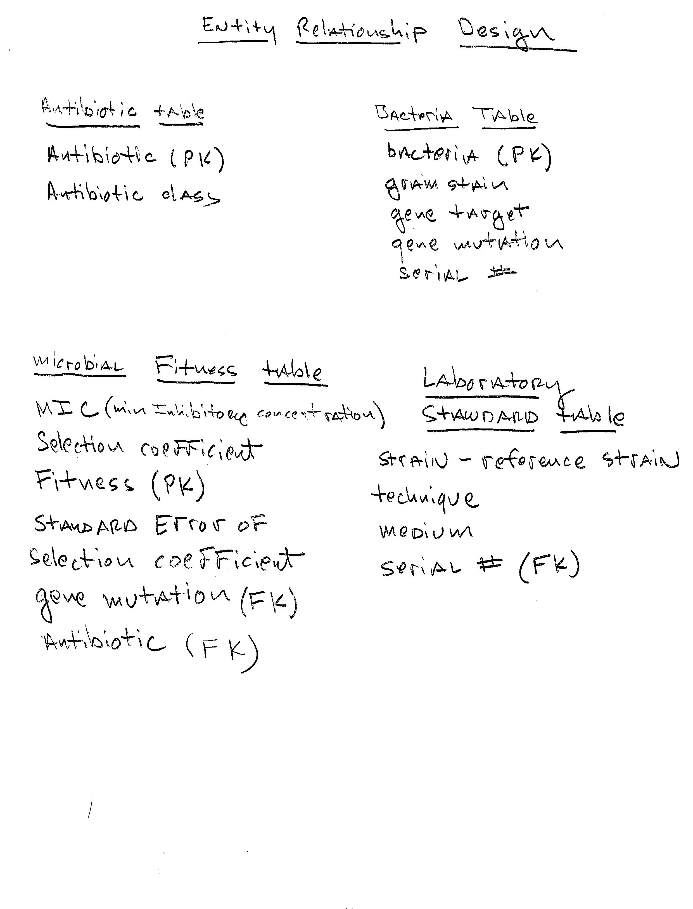

# Build ATB database

## Build the database with four tables, which will contain all of the data for the analysis.

```{r}

file_path <-"C:/Users/Jacob/Documents/Projects_R/553_WLF02/Raw_data/costR.csv"
costR <-  read.csv(file_path)

```

# Data set Metrics
The data set is composed of multiple instances of common pathogenic microorganisms, both gram positive and gram cost, Selection coefficient, standard error, specific gene mutations, antibiotics and antibiotic class.  Additional information included reference population, gene target and bacterial medium used to grow the different bacterial species. The data focuses on fitness effects of **single** chromosomal mutations.


```{r image_relationship, fig.cap="Database Diagram", fig.align='center', out.width='100%'}

```


```{r}
#Create ATB database ####
library(DBI)
library(RSQLite)
library(tidyverse)
antibiotic_db <- dbConnect(drv = RSQLite::SQLite(),                           "C:/Users/Jacob/Documents/Projects_R/553_WLF02/databases_WLF/ATB.db")
#Create the tables that will populate the ATB database
#Create Antibiotic_Table containing antibiotics and class


dbExecute(antibiotic_db, "
  CREATE TABLE IF NOT EXISTS Antibiotic_Table (
    antibioticType varchar(20) NOT NULL PRIMARY KEY,
    antibioticClass varchar(20)
  );
")
#Create Bacteria table containing bacteria,
#gram stain, gene target and gene mutation
dbExecute(antibiotic_db, "
  CREATE TABLE IF NOT EXISTS Bacteria (
    bacteria varchar(10) NOT NULL PRIMARY KEY,
    gram_stain varchar(10),
    gene_target varchar(10),
    gene_mutation varchar(15),
    serial_num real
  );
")
#create microbial fitness table
dbExecute(antibiotic_db, "
  CREATE TABLE IF NOT EXISTS microbial_fitness (
    fitness varchar(10) NOT NULL PRIMARY KEY,
    MIC real,
    Selection_coefficient real,
    SE real,
    gene_mutation varchar(50),
    antibiotic varchar(50),
    FOREIGN KEY (gene_mutation) REFERENCES Bacteria (gene_mutation),
    FOREIGN KEY (antibiotic) REFERENCES Antibiotic_Table (antibioticType)
  );
")
#create Laboratory standard table
dbExecute(antibiotic_db, "
  CREATE TABLE IF NOT EXISTS Laboratory_standard (
    strain_reference varchar(25),
    technique varchar(20),
    medium varchar(20),
    serial_num real,
    FOREIGN KEY (serial_num) REFERENCES Bacteria (serial_num)
  );
")


```


# Extract and select the data from the spreadsheet that will be entered into each table.
```{r}
atbdf <-  costR %>% 
  select(antibioticType, antibioticClass) %>% 
  distinct()

distinctBac <- costR %>% 
  select(bacteria, gram_stain, gene_target, gene_mutation) %>% 
  distinct()

FIT <-  costR %>% 
  select(MIC, Selection_coefficient,
         fitness, SE, gene_mutation, antibioticType) %>% 
  distinct()

REF <-  costR %>% 
  select(strain_reference, technique, medium) %>% 
  distinct()
```

```{r}
if ("Antibiotic_Table" %in% dbListTables(antibiotic_db)) {
  dbExecute(antibiotic_db, "DROP TABLE Antibiotic_Table")
}
dbWriteTable(antibiotic_db, "Antibiotic_Table", atbdf, overwrite = TRUE)

```


# Populate each table of the ATB.db with the selected data ####

```{r}
dbWriteTable(antibiotic_db, "Antibiotic_Table", atbdf, overwrite = TRUE)
dbWriteTable(antibiotic_db, "Bacteria", distinctBac, overwrite = TRUE)
dbWriteTable(antibiotic_db, "microbial_fitness", FIT, overwrite = TRUE)  
dbWriteTable(antibiotic_db, "Laboratory_standard", REF, overwrite = TRUE)


dbListFields(antibiotic_db, "Antibiotic_Table")
dbListFields(antibiotic_db, "Bacteria")


dbReadTable(antibiotic_db, "microbial_fitness")
dbReadTable(antibiotic_db, "Bacteria")
```


