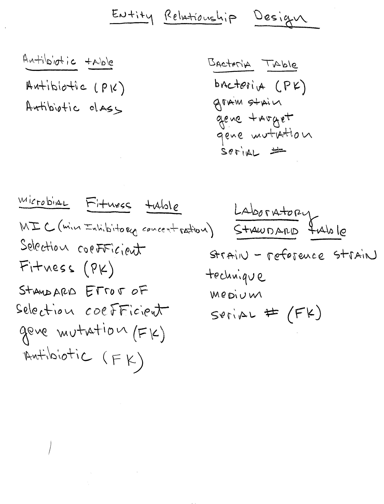

# Build ATB database

## Institiant the database and build the four tables, which will contain all of the data for the analysis.

```{r}

file_path <-"C:/Users/Jacob/Documents/Projects_R/553_WLF02/Raw_data/costR.csv"
costR <-  read.csv(file_path)
library(tidyverse)
glimpse(costR)
```


Below are the 4 tables and the relationships between each one.
```{r image, fig.cap="Database Diagram", fig.align='center', out.width='100%'}

```


```{r}
#Create ATB database ####
library(DBI)
library(RSQLite)
antibiotic_db <- dbConnect(drv = RSQLite::SQLite(),                           "C:/Users/Jacob/Documents/Projects_R/553_WLF02/databases_WLF/ATB.db")
#Create the tables that will populate the ATB database
#Create Antibiotic_Table containing antibiotics and class ####
dbExecute(antibiotic_db,
          "CREATE TABLE Antibiotic_Table(
          antibioticType varchar(20) NOT NULL PRIMARY KEY,
          antibioticClass varchar(20));")

#Create Bacteria table containing bacteria,
#gram stain, gene target and gene mutation ####
dbExecute(antibiotic_db,
          "CREATE TABLE Bacteria(
            bacteria varchar(10) NOT NULL PRIMARY KEY,
          gram_stain varchar(10),
          gene_target varchar(10),
          gene_mutation varchar(15),
          serial_num real);") 

#create microbial fitness table ####
dbExecute(antibiotic_db,
"CREATE TABLE microbial_fitness (
  fitness varchar(10) NOT NULL PRIMARY KEY,
  MIC real,
  Selection_coefficient real,
  SE real,
  gene_mutation varchar(50),
  antibiotic varchar(50),
  FOREIGN KEY (gene_mutation) REFERENCES Bacteria (gene_mutation),
  FOREIGN KEY (antibiotic) REFERENCES Antibiotic(antibiotic)
);")


#create Laboratory standard table
dbExecute(antibiotic_db,
          "CREATE TABLE Laboratory_standard(
          strain_reference varchar(25),
          technique varchar(20),
          medium varchar(20),
          serial_num real,
          FOREIGN KEY (serial_num) REFERENCES Bacteria (serial_num));")

```


## Extract the data from the spreadsheet.

```{r}

```


## Take the extracted data and place it into each of the 4 tables in the database.
```{r}

```

## Verify that the data can be extracted from the table

```{r}

```


## Chapters and sub-chapters

There are two steps to cross-reference any heading:

1. Label the heading: `# Hello world {#nice-label}`. 
    - Leave the label off if you like the automated heading generated based on your heading title: for example, `# Hello world` = `# Hello world {#hello-world}`.
    - To label an un-numbered heading, use: `# Hello world {-#nice-label}` or `{# Hello world .unnumbered}`.

1. Next, reference the labeled heading anywhere in the text using `\@ref(nice-label)`; for example, please see Chapter \@ref(cross). 
    - If you prefer text as the link instead of a numbered reference use: [any text you want can go here](#cross).

## Captioned figures and tables

Figures and tables *with captions* can also be cross-referenced from elsewhere in your book using `\@ref(fig:chunk-label)` and `\@ref(tab:chunk-label)`, respectively.

See Figure \@ref(fig:nice-fig).

```{r nice-fig, fig.cap='Here is a nice figure!', out.width='80%', fig.asp=.75, fig.align='center', fig.alt='Plot with connected points showing that vapor pressure of mercury increases exponentially as temperature increases.'}
par(mar = c(4, 4, .1, .1))
plot(pressure, type = 'b', pch = 19)
```

Don't miss Table \@ref(tab:nice-tab).

```{r nice-tab, tidy=FALSE}
knitr::kable(
  head(pressure, 10), caption = 'Here is a nice table!',
  booktabs = TRUE
)
```
